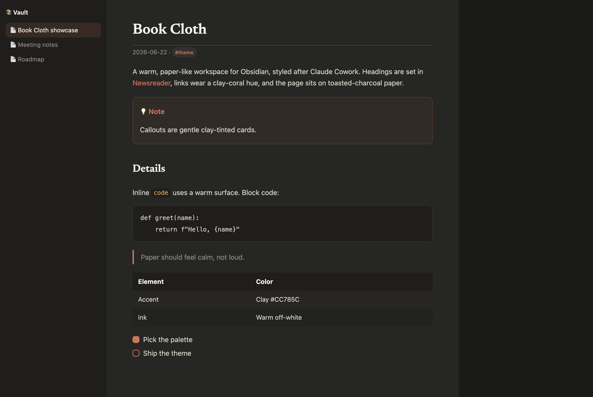

# Book Cloth

A dark-only Obsidian theme styled after **Claude Cowork** — warm toasted-charcoal
paper, a clay/coral accent, warm off-white ink, and serif (Newsreader) headings.

## Install

**Manual:**
1. Create the folder `<your vault>/.obsidian/themes/Book Cloth/`.
2. Copy `manifest.json` and `theme.css` into it.
3. In Obsidian: **Settings → Appearance → Themes → Book Cloth**.

## Features

- Warm, paper-like dark surfaces (warm-neutral, never blue-grey).
- Clay/coral accent (`#CC785C`) on links, tags, checkboxes, and the active tab.
- Serif headings via bundled Newsreader — no network fetch, identical on every machine.
- Full coverage: editor, callouts, tables, code, plus app chrome and UI.

## Credits

- Heading font: [Newsreader](https://fonts.google.com/specimen/Newsreader) by Production Type (SIL OFL 1.1).
- Theme © 2026 SurprisedDuck, MIT.
